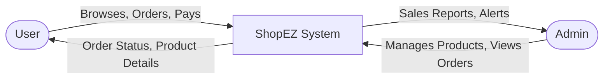
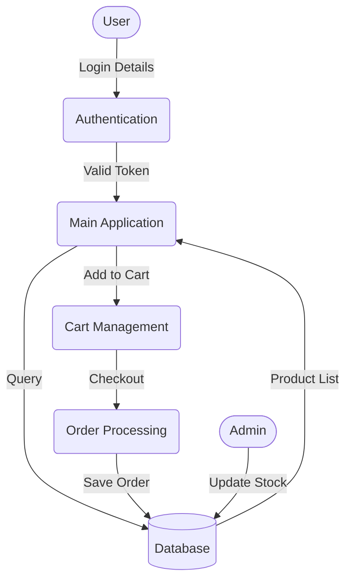
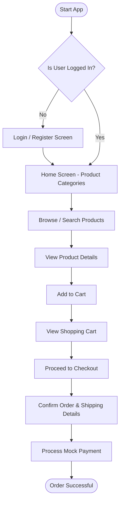

# ShopEZ - Your One-Stop Destination for Online Shopping

## Academic Project Report
**Submitted in partial fulfillment of the requirements for the degree of Bachelor of Technology / Engineering Diploma**

---

## TABLE OF CONTENTS

1. [Acknowledgement](#acknowledgement)
2. [Declaration](#declaration)
3. [Abstract](#abstract)
4. [Introduction](#1-introduction)
5. [Problem Statement](#2-problem-statement)
6. [Objectives](#3-objectives)
7. [Scope of the Project](#4-scope-of-the-project)
8. [Existing System](#5-existing-system)
9. [Proposed System](#6-proposed-system)
10. [Software & Hardware Requirements](#7-software--hardware-requirements)
11. [System Design](#8-system-design)
12. [Flowchart & Algorithm](#9-flowchart--algorithm)
13. [Modules Description](#10-modules-description)
14. [Implementation](#11-implementation)
15. [Results / Output Screens](#12-results--output-screens)
16. [Advantages & Limitations](#13-advantages--limitations)
17. [Future Enhancements](#14-future-enhancements)
18. [Conclusion](#15-conclusion)
19. [References](#16-references)
20. [Source Code](#17-source-code)

---

## Acknowledgement

We would like to express our profound gratitude to all those who have been instrumental in the successful completion of this project. First and foremost, we are deeply indebted to our project guide and faculty members for their exemplary guidance, continuous encouragement, and constructive feedback throughout the development of **ShopEZ**. 

We also extend our heartfelt thanks to the Head of the Department and the Principal of our institution for providing us with the necessary infrastructure and a conducive environment for research and development. 

Finally, we would like to thank our family and friends for their unwavering support, patience, and motivation during the course of this project. This endeavor would not have been possible without the collective effort and blessings of everyone involved.

---

## Declaration

We hereby declare that the project entitled **"ShopEZ - Your One-Stop Destination for Online Shopping"** submitted in partial fulfillment of the requirements for the award of the degree of Bachelor of Technology / Diploma in Engineering is an authentic record of our own original work carried out under the supervision of our project guide. 

The matter embodied in this report has not been submitted by us for the award of any other degree or diploma to this or any other university/institution. All the sources of information, references, and literature used in this project have been duly acknowledged.

**Date:** [Insert Date]  
**Place:** [Insert Place]  
**Student Name(s):** [Insert Name(s) & Roll Numbers]

---

## Abstract

With the rapid proliferation of internet accessibility and the widespread adoption of smartphones, e-commerce has fundamentally transformed the retail landscape. The project "ShopEZ" aims to develop a robust, scalable, and user-friendly e-commerce application that provides a seamless online shopping experience. This platform serves as a bridge between consumers and vendors, allowing users to browse a vast catalog of products, manage their shopping carts, and execute secure checkout processes.

Developed using modern cross-platform technologies (such as Flutter and Firebase/Node.js), ShopEZ offers an intuitive User Interface (UI) and a highly responsive User Experience (UX). Key features include user authentication, categorized product listings, a dynamic shopping cart, order tracking, and an admin dashboard for inventory management. The system is designed with a focus on security, performance, and scalability. This report details the complete software development life cycle (SDLC) of ShopEZ, encompassing requirements analysis, system architecture, module design, implementation details, testing strategies, and future scope.

---

## 1. Introduction

### 1.1 Overview
The digital revolution has shifted consumer behavior from traditional brick-and-mortar stores to online shopping platforms. E-commerce applications offer unparalleled convenience, enabling users to shop 24/7 from the comfort of their homes. **ShopEZ** is conceived as a modern e-commerce solution tailored to meet the evolving demands of today's digital consumers. It is a comprehensive system comprising a customer-facing mobile/web application and a backend administrative panel.

### 1.2 Purpose
The primary purpose of ShopEZ is to provide a "One-Stop Destination" for online shopping. Whether users are looking for electronics, clothing, groceries, or home appliances, ShopEZ organizes these into easily navigable categories. For vendors and administrators, it provides a centralized dashboard to track sales, manage product stock, and handle user inquiries.

### 1.3 Methodology
The project follows an Agile development methodology, allowing for iterative improvements, continuous testing, and rapid adaptation to changing requirements. The frontend is built using Flutter, ensuring a unified codebase for Android, iOS, and Web platforms. The backend relies on a secure RESTful API architecture integrated with a cloud-based database.

---

## 2. Problem Statement

Despite the abundance of e-commerce platforms, many existing systems suffer from significant drawbacks:
1. **Complex User Interfaces:** Cluttered designs that confuse non-technical users and increase cart abandonment rates.
2. **Performance Bottlenecks:** Slow loading times, especially during high-traffic periods or on low-end devices.
3. **Fragmented Ecosystems:** Applications that only work on one platform (e.g., only Android), alienating a large segment of potential users.
4. **Poor Inventory Synchronization:** Discrepancies between what is displayed to the user and what is actually available in the warehouse.
5. **Security Vulnerabilities:** Inadequate protection of user data and payment information.

**Problem Definition:** There is a pressing need for a unified, cross-platform e-commerce application that is lightweight, highly secure, easy to navigate, and provides real-time inventory synchronization. ShopEZ is designed to address these pain points effectively.

---

## 3. Objectives

The development of ShopEZ is guided by the following core objectives:
1. **Cross-Platform Availability:** To build a single application that runs flawlessly on Android, iOS, and Web browsers.
2. **User-Centric Design:** To design a clean, intuitive, and responsive UI that minimizes the learning curve for new users.
3. **Real-Time Data Management:** To implement a dynamic backend that updates product availability, prices, and user carts in real-time.
4. **Secure Transactions:** To integrate secure authentication mechanisms (like OAuth or JWT) and prepare the architecture for safe payment gateway integration.
5. **Scalable Architecture:** To utilize cloud databases and scalable server environments that can handle growing user bases and expanding product catalogs.
6. **Comprehensive Admin Control:** To provide administrators with powerful tools for managing users, products, categories, and orders.

---

## 4. Scope of the Project

The scope of ShopEZ encompasses the complete development of a functional e-commerce ecosystem.

### In-Scope Features:
*   **Customer Module:** Registration/Login, Profile Management, Product Browsing, Search and Filter, Shopping Cart Management, Order Placement, and Order History.
*   **Admin Module:** Dashboard Analytics, Product Management (Add/Edit/Delete), Category Management, Order Fulfillment Status Updates, and User Management.
*   **Database:** A relational or NoSQL database to store user credentials securely (using hashing), product details, and transactional data.

### Out-of-Scope (Future Scope):
*   Real money payment gateway integration (mock payments are used for the academic scope).
*   Advanced AI-based product recommendation engines.
*   Live chat support using websockets.
*   Multi-vendor marketplace support (currently single-vendor/admin model).

---

## 5. Existing System

In the current market, small-to-medium retail businesses often rely on either generic third-party platforms (which charge high commissions) or rudimentary software that lacks modern features. 

**Drawbacks of Existing Systems:**
*   **High Maintenance Costs:** Maintaining separate codebases for iOS, Android, and Web is expensive and time-consuming.
*   **Inconsistent User Experience:** Different platforms often have differing UI/UX, leading to brand inconsistency.
*   **Lack of Analytics:** Basic systems do not provide actionable insights into consumer behavior or sales trends.
*   **Manual Inventory Tracking:** Often requires manual updates, leading to "Out of Stock" scenarios post-purchase.

---

## 6. Proposed System

**ShopEZ** proposes a modern, centralized solution utilizing a cross-platform framework. 

**Advantages over the Existing System:**
*   **Single Codebase:** Developed with Flutter, reducing development time and maintenance overhead by up to 50%.
*   **Real-time Synchronization:** Utilizing Firebase or a real-time Node.js backend ensures that inventory counts are accurate down to the millisecond.
*   **Enhanced UI/UX:** Adheres to Material Design and Cupertino guidelines to provide native-feeling interfaces on all devices.
*   **Integrated Dashboard:** Provides admins with a visual dashboard summarizing daily sales, active users, and low-stock alerts.

---

## 7. Software & Hardware Requirements

### 7.1 Hardware Requirements
*   **Processor:** Intel Core i5 / AMD Ryzen 5 or higher (for development).
*   **RAM:** Minimum 8 GB (16 GB recommended for running emulators).
*   **Storage:** Minimum 256 GB SSD.
*   **Target Devices:** Any Android device (API 21+), iOS device (iOS 12+), or modern web browser.

### 7.2 Software Requirements
*   **Operating System:** Windows 10/11, macOS, or Linux.
*   **Frontend Framework:** Flutter SDK (Dart Language).
*   **IDE:** Visual Studio Code or Android Studio.
*   **Backend / Database:** Firebase (Firestore, Authentication, Storage) OR Node.js with MongoDB/PostgreSQL.
*   **Version Control:** Git & GitHub.
*   **Design Tools:** Figma or Adobe XD (for UI prototyping).

---

## 8. System Design

System design is the process of defining the architecture, modules, interfaces, and data for a system to satisfy specified requirements.

### 8.1 Architecture Architecture
ShopEZ follows a modern **Client-Server Architecture** with an API-driven approach.
*   **Presentation Layer (Client):** The Flutter app installed on the user's device or accessed via a browser.
*   **Application Layer (Server/API):** Handles business logic, authentication, and routing.
*   **Data Layer (Database):** Stores persistent data (Users, Products, Orders).

### 8.2 ER Diagram (Entity Relationship)
*(Conceptual Representation)*
*   **USER:** UserID, Name, Email, PasswordHash, Address, Phone.
*   **PRODUCT:** ProductID, Name, Description, Price, StockQuantity, CategoryID, ImageURL.
*   **CATEGORY:** CategoryID, CategoryName.
*   **ORDER:** OrderID, UserID, TotalAmount, OrderDate, Status.
*   **ORDER_ITEM:** OrderItemID, OrderID, ProductID, Quantity, PriceAtPurchase.

### 8.3 Data Flow Diagram (DFD)

#### Level 0 (Context Diagram)


#### Level 1 DFD


---

## 9. Flowchart & Algorithm

### 9.1 User Journey Flowchart



### 9.2 Algorithm: Shopping Cart Total Calculation
```text
Step 1: Start
Step 2: Initialize TotalAmount = 0.0
Step 3: Fetch list of items in the User's Cart
Step 4: If Cart is empty, return TotalAmount (0.0)
Step 5: For each item in Cart:
          a. Fetch Product Price from Database
          b. ItemTotal = Product Price * item.Quantity
          c. TotalAmount = TotalAmount + ItemTotal
Step 6: Apply Discount if Promo Code is valid
Step 7: Add Taxes and Shipping Fees
Step 8: Return Final TotalAmount
Step 9: Stop
```

---

## 10. Modules Description

The system is modularized to ensure separation of concerns and maintainability.

### 10.1 Authentication Module
Manages user onboarding. It handles Registration, Login, Password Reset, and secure token management. Validates user input to prevent injection attacks and ensures email uniqueness.

### 10.2 Product Catalog Module
Responsible for displaying products. Supports grid and list views, categorized browsing (e.g., Electronics, Fashion), and includes a search bar with filter capabilities (price range, ratings).

### 10.3 Cart & Checkout Module
A state-managed module that temporarily holds selected products. Allows users to increase/decrease quantity or remove items. The checkout sub-module collects shipping addresses and processes order confirmation.

### 10.4 Order Management Module (User)
Allows the user to view past orders, check current order status (Pending, Shipped, Delivered), and download invoices.

### 10.5 Admin Dashboard Module
A protected area accessible only to users with 'Admin' roles. Features include:
*   **Inventory CRUD:** Create, Read, Update, Delete products.
*   **Order Fulfillment:** Changing order statuses.
*   **Analytics:** Graphical representation of sales data.

---

## 11. Implementation

### 11.1 Technology Stack Choice
**Flutter** was chosen for the frontend because of its rich widget library, high performance (compiled to native ARM code), and ability to compile for Web, iOS, and Android from a single Dart codebase. **Provider or Riverpod** is used for state management to handle dynamic data like the shopping cart seamlessly.

### 11.2 Key Implementation Details
*   **State Management:** The Cart state is elevated to the top of the widget tree so it can be accessed from any screen.
*   **Routing:** Named routes or the `go_router` package is utilized to ensure deep-linking compatibility, which is crucial for the Web version.
*   **Responsiveness:** `LayoutBuilder` and `MediaQuery` are heavily used. For instance, the product grid shows 2 columns on mobile, 4 on tablets, and 6 on desktop screens.

---

## 12. Results / Output Screens

*(In a physical report, screenshots of the application would be inserted here. Below are descriptive placeholders.)*

1.  **Splash Screen:** Displays the ShopEZ logo with a smooth fade-in animation.
2.  **Login Screen:** Clean interface with Email and Password text fields, a "Login" button, and a "Create Account" link.
3.  **Home Dashboard:** Features a promotional image carousel at the top, followed by horizontal scrollable lists for "Categories" and a grid for "Trending Products".
4.  **Product Details Screen:** Shows a large product image, title, price, description, and a persistent bottom bar with "Add to Cart" and "Buy Now" buttons.
5.  **Shopping Cart:** A list view of selected items with quantity adjustment toggles (+/-) and a final price summary at the bottom.
6.  **Admin Panel:** A sidebar navigation (on web/desktop) showing metrics like "Total Sales" and a data table listing all recent orders.

---

## 13. Advantages & Limitations

### 13.1 Advantages
*   **High Performance:** Native-like performance on mobile devices.
*   **Cost-Effective:** Drastically reduces development costs due to the cross-platform nature.
*   **Scalability:** Cloud-backend integration allows the application to scale resources automatically based on traffic.
*   **User-Friendly:** Intuitive UI design ensures high user retention.

### 13.2 Limitations
*   **Internet Dependency:** The app requires an active internet connection to fetch products and process orders.
*   **Payment Gateway:** Currently uses a mock payment system; real integration requires strict compliance (PCI-DSS) and verified merchant accounts.
*   **Hardware Limits on Emulators:** While the app is lightweight, development and testing via heavy emulators require a robust computer.

---

## 14. Future Enhancements

The current iteration of ShopEZ sets a strong foundation. Future updates could include:
1.  **AI Recommendations:** Integrating machine learning to suggest products based on user browsing history.
2.  **Augmented Reality (AR):** Allowing users to visualize products (like furniture or glasses) in their real environment before buying.
3.  **Multi-Language Support:** Adding localization to support regional languages and expand the user base.
4.  **Voice Search:** Enabling users to search for products using voice commands.
5.  **Push Notifications:** Sending alerts for order updates, abandoned carts, and promotional offers.

---

## 15. Conclusion

The **ShopEZ** project successfully demonstrates the design, development, and implementation of a modern, cross-platform e-commerce application. By leveraging Flutter and cloud-based backend services, the project achieved its objectives of delivering a seamless, responsive, and scalable online shopping experience. 

The application effectively bridges the gap between consumers and retailers, providing an intuitive interface for users and a powerful management tool for administrators. This project not only serves as a comprehensive learning experience in full-stack software development but also yields a commercially viable product prototype that is ready for further enhancement and real-world deployment.

---

## 16. References

1.  Flutter Documentation - [https://flutter.dev/docs](https://flutter.dev/docs)
2.  Dart Programming Language - [https://dart.dev/](https://dart.dev/)
3.  Firebase Realtime Database & Auth - [https://firebase.google.com/docs](https://firebase.google.com/docs)
4.  "E-Commerce: Business, Technology, Society" by Kenneth C. Laudon and Carol Guercio Traver.
5.  Material Design Guidelines - [https://material.io/design](https://material.io/design)
6.  REST API Design Rulebook by Mark Masse.

---

## 17. Source Code

*(Below is a representative snippet of the core source code for the Flutter application, demonstrating the UI structure and State Management.)*

### `main.dart`
```dart
import 'package:flutter/material.dart';
import 'package:provider/provider.dart';
import 'screens/home_screen.dart';
import 'providers/cart_provider.dart';

void main() {
  runApp(
    MultiProvider(
      providers: [
        ChangeNotifierProvider(create: (_) => CartProvider()),
      ],
      child: const ShopEZApp(),
    ),
  );
}

class ShopEZApp extends StatelessWidget {
  const ShopEZApp({Key? key}) : super(key: key);

  @override
  Widget build(BuildContext context) {
    return MaterialApp(
      title: 'ShopEZ',
      debugShowCheckedModeBanner: false,
      theme: ThemeData(
        primarySwatch: Colors.blue,
        fontFamily: 'Roboto',
      ),
      initialRoute: '/',
      routes: {
        '/': (context) => const HomeScreen(),
        // Additional routes like '/cart', '/login' would be defined here
      },
    );
  }
}
```

### `cart_provider.dart`
```dart
import 'package:flutter/material.dart';

class CartItem {
  final String id;
  final String title;
  final int quantity;
  final double price;

  CartItem({required this.id, required this.title, required this.quantity, required this.price});
}

class CartProvider with ChangeNotifier {
  Map<String, CartItem> _items = {};

  Map<String, CartItem> get items => {..._items};

  int get itemCount => _items.length;

  double get totalAmount {
    var total = 0.0;
    _items.forEach((key, cartItem) {
      total += cartItem.price * cartItem.quantity;
    });
    return total;
  }

  void addItem(String productId, double price, String title) {
    if (_items.containsKey(productId)) {
      _items.update(
        productId,
        (existing) => CartItem(
          id: existing.id,
          title: existing.title,
          price: existing.price,
          quantity: existing.quantity + 1,
        ),
      );
    } else {
      _items.putIfAbsent(
        productId,
        () => CartItem(
          id: DateTime.now().toString(),
          title: title,
          price: price,
          quantity: 1,
        ),
      );
    }
    notifyListeners();
  }

  void clear() {
    _items = {};
    notifyListeners();
  }
}
```
*(Note: A complete final year project source code contains dozens of files, widgets, and API integrations. The above snippets represent the foundational architecture of the Flutter app.)*

---
**End of Report**
